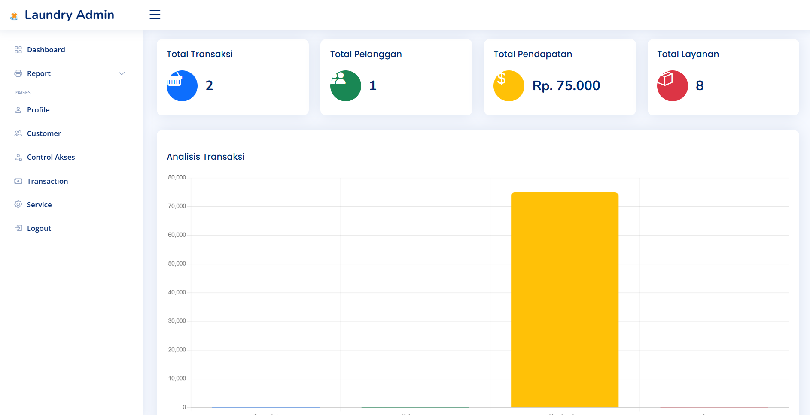
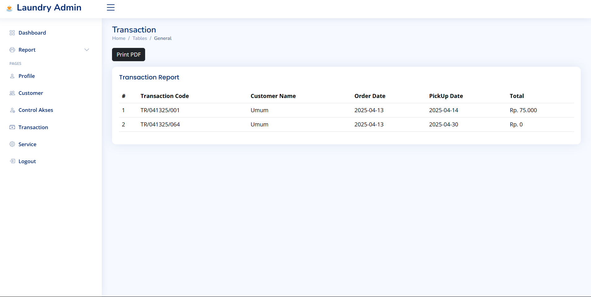
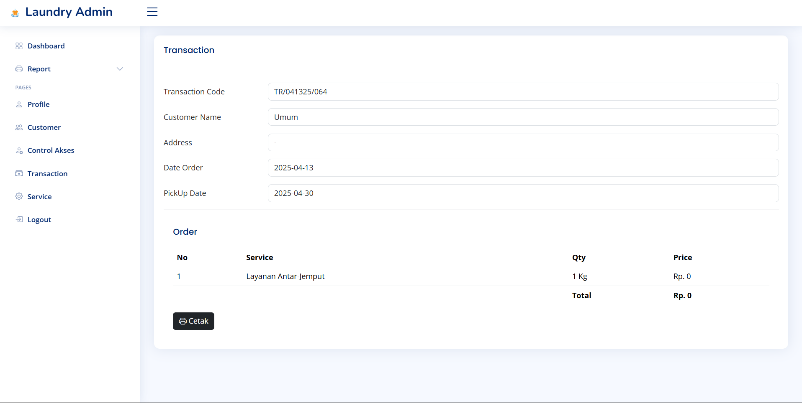
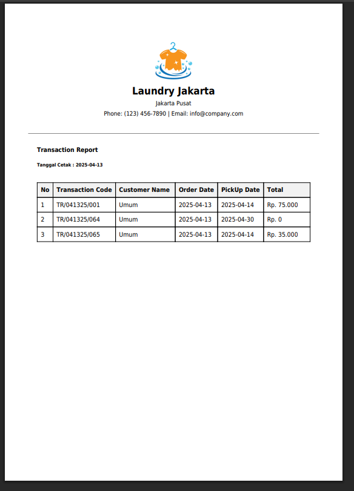
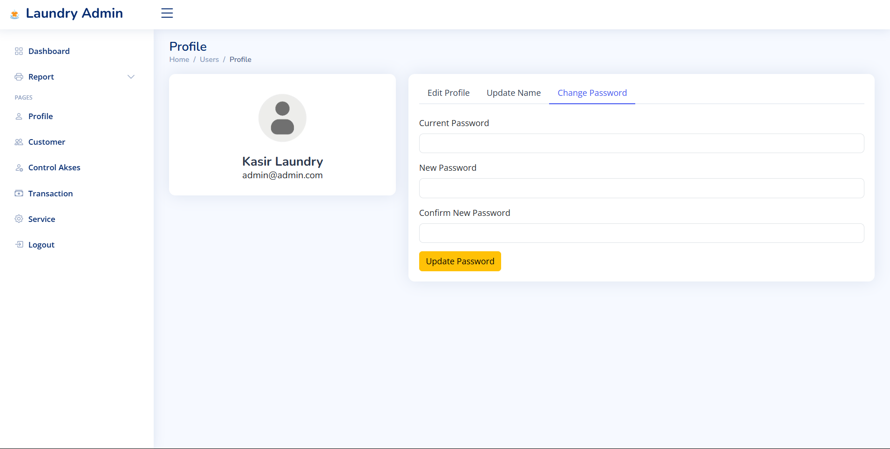
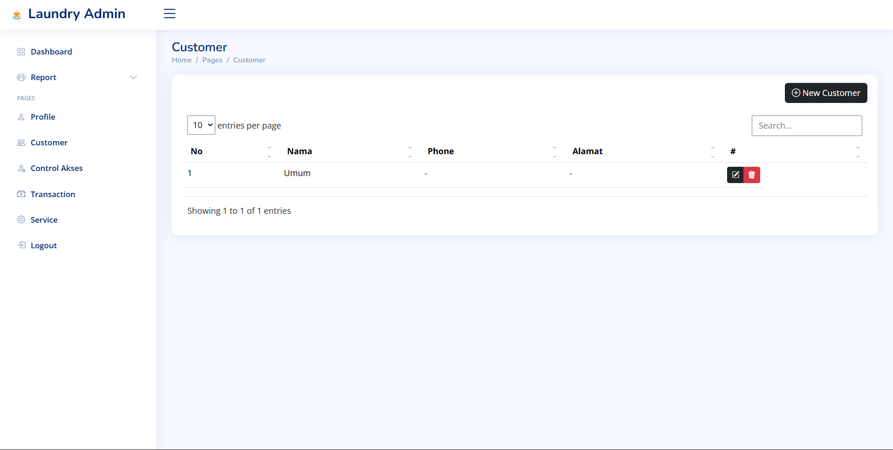
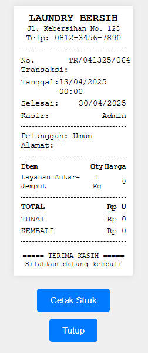
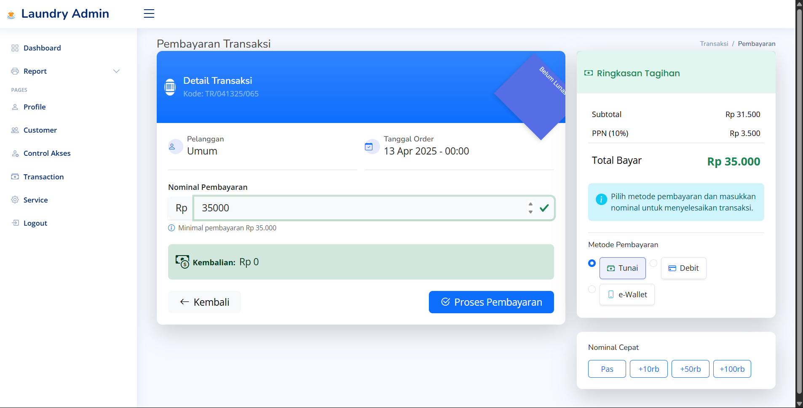
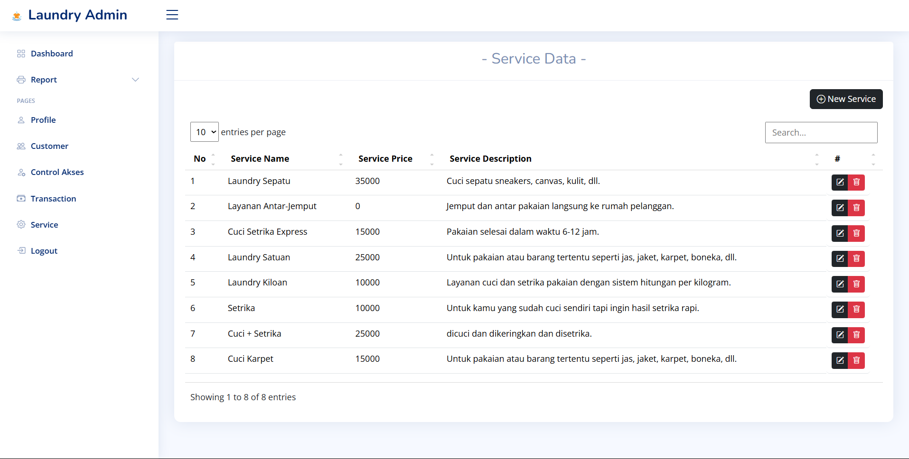

# Point of Sale (POS) Laundry
Website Point of Sale (POS) Laundry ini dikembangkan sebagai bagian dari pembelajaran PHP Native. Sistem ini bertujuan untuk mempermudah proses transaksi dan manajemen di bisnis laundry dengan menyediakan solusi untuk pencatatan transaksi, pengelolaan pelanggan, serta laporan penjualan secara real-time.

## Teknologi yang Digunakan
Bootstrap 5  
php Native  
Mysql  

## dashboard

## Transaction

## Profile

## Customer

## Print

## Payment

## Service

